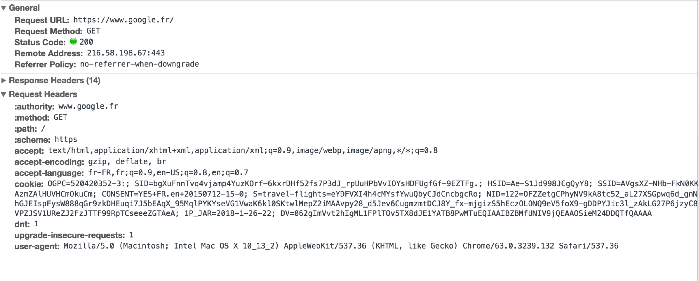
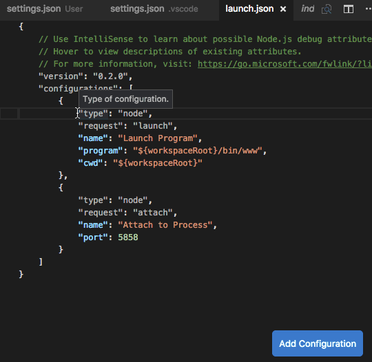

# Récapitulatif du cours Semaine du 20 Janvier 2020

## Notions théoriques

### Quelques mots sur Javascript
JavaScript est un langage qui a plus de 20 ans et a connu et continue à connaitre beaucoup d’évolutions. Dans ça dernière version on parle de `ES6` / `ecmascript 2017` qui fait référence à la version de EcmaScript implémenté par JavaScript. Pour rappel ECMAScript est un ensemble de normes qui définissent les fonctionnalités et comportement du langage JavaScript. Pouvant être aussi bien utilisé coté backend (via NodeJS) que Front-end (Navigateur Internets), JavaScript dans sa version ES6 n’est supporté que par les dernières versions de Chrome, Firefox, Edge, … Afin d’être compatible avec des versions plus anciennes, il est nécessaire de convertir le code JS en ES5 à l’aide d’outils comme https://babeljs.io. ES6 est de plus en plus utilisé par la communauté, car ces nouvelles fonctionnalités simplifient le développement, et la qualité du code produit.

Plus d’informations sur Javascript
[JavaScript | MDN](https://developer.mozilla.org/fr/docs/Web/JavaScript)
Feature clés en ES6 [Top 10 ES6 Features Every Busy JavaScript Developer Must Know](https://webapplog.com/es6/) (English)

### Quelques mots sur NodeJS
Permet d’exécuter du Javascript coté backend.
Peut s’installer sur Windows, MacOS, Linux, aussi bien sur des Environnements de Développement (vos machines de dev) que sur des serveurs de production.

### Fonctionnement Client / Serveur

Videos explicatives

* Comprendre le serveur web en 2 minutes: https://www.youtube.com/watch?v=msB9AvJ4bTM
* Le serveur d'applications expliqué en 2 minutes: https://www.youtube.com/watch?v=Y-ET4W4jjWY

#### L’anatomie d’une requête HTTP

Nous avons vu: comment fonctionne une requête HTTP
Lorsqu’une requête HTTP est envoyée, celle-ci contient une série d’information sur la destination de la requête
```
CONNECT www.google.com:443 HTTP/1.1
Host: www.google.com
Connection: keep alive
```

Ici, on utilise la version `1.1` du protocol `HTTP` afin d’accéder à la ressource (= ici c’est une pages HTML) disponible à l’url `www.google.com` via le port `443` (= HTTPS). En plus de ces informations, la requête HTTP contient aussi une série de “Header HTTP” permettant au client de donner des informations au serveur le concernant.

Ci-dessous un screenshot obtenu via l'onglet "Network" dans le [Chrome DevTools](https://developer.chrome.com/devtools)


En réponse le serveur nous à retourné un document de type `MIME = text/html`

```
Status: HTTP/1.1 200 OK
Content-Length: 44
Content-Type: text/html
<html><head>...</html></head>
```

#### MIME
Pour rappel le MIME est équivalent aux extensions de fichier sur Windows / macOS. Il permet aux client & serveur de savoir quels types de fichiers accepter ou renvoyer. Les plus courants sont
  * text/html
  * application/json
  * application/xml
  * image/png, image/jpeg
  * Liste plus exhaustive dispo [Liste complète des types MIME | MDN](https://developer.mozilla.org/fr/docs/Web/HTTP/Basics_of_HTTP/MIME_types/Complete_list_of_MIME_types)

#### Les ports
Lorsque l’on se connecte à un site, par défaut le port utilisé est le port 80, ou bien 443 lorsque la connexion est sécurisée (= HTTPs). Cela étant dit il est tout à fait possible de choisir un autre port, ce qui est quelque chose de très courant en développement Web afin de ne pas créer de conflit avec les ports utilisés par défaut. Sont souvent utilisés, les ports `3000`  `8080`  `5000`


#### Résolution DNS
Résolution d’une nom-de-domain.com en adresse IP grasse aux serveurs DNS.

* Videos explicatives
    * Comprendre le DNS en 5 minutes: https://www.youtube.com/watch?v=qzWdzAvfBoo (French)
    * Résolution d’un nom de domaine en cascade - https://www.youtube.com/watch?v=3EvjwlQ43_4 (English)
* Une fois l’adresse IP obtenue, le “client” faisant la requête, met en “cache” l’IP afin de ne pas avoir à redemander aux serveurs DNS à chaque nouvelle requête.

## Mise en pratique

### 01 Command line: Execution d'un script depuis l'interpreteur de commandes
```js
const fruits = ['Fraise', 'Orange', 'Melon'];

for (let i = 0; i < fruits.length; i++) {
    console.log(fruits[i]);
}

```
Lancer le serveur NodeJS via la commande `node app.js` ou via VSCode directement.


### 02 Basic Web Server: Serveur basic sur le port 3000 - Hello World

**./app.js**
```js
const http = require('http');

// ES5
//http.createServer(function (req, res) {
//})

// ES6
http.createServer((req, res) => {
    res.writeHead(200, { 'Content-Type': 'text/html' });
    res.write('<b>Hello world</b>');
    res.end();
}).listen(3000, '127.0.0.1');
```

Pour afficher le "Hello World" dans le navigateur

* Lancer le serveur NodeJS via la commande `node app.js` ou via VSCode directement.
* Ouvrir l'url `http://localhost:3000` via votre navigateur favori

Fonctionnement de `req` et `res`:

- `req` (pour _request_) : il contient tout ce qui a été reçu dans la requête HTTP envoyée par l'utilisateur
- `res` (pour _result_) : il contient toutes les données et fonctions que l'on va utiliser pour préparer et envoyer la réponse du serveur vers l'utilisateur

### 03 Basic Web Server - Fruit list: Afficher un fichier HTML depuis un fichier séparé, et insérer dynamique une liste

**./app.js**
```js
const http = require('http');
const fs = require('fs');

const fruits = ['Fraise', 'Orange', 'Melon'];

http.createServer((req, res) => {

    let html = fs.readFileSync(__dirname + '/fruits.html', 'utf8');

    let listHtml = '';
    fruits.forEach( (fruit) => {
      listHtml += `<li>${fruit}</li>`;
    });
    html = html.replace('#fruit_list#', listHtml);

    res.writeHead(200, { "Content-Type": "text/html"});
    res.write(html);
    res.end();

}).listen(3000, "127.0.0.1");

```

**./index.html**
```html
<html>
    <head>
        <title>Liste de fruits</title>
    </head>
    <body>
        <b>Ma liste</b>
        <ul>
            #fruit_list#
        </ul>
    </body>
</html>
```

#### Info: Utilisation des stream
En production il est préférable d'utiliser les Stream de NodeJS, qui permettent de meilleur performances.

**./app.js**
```js
const http = require('http');
const fs = require('fs');

http.createServer((req, res) => {
    res.writeHead(200, { "Content-Type": "text/html"});
    fs.createReadStream(__dirname + '/index.html', 'utf8').pipe(res);

}).listen(3000, "127.0.0.1");
```

### 04 Basic Web Server - JSON: Retourner une réponse au fomat JSON

```js
const http = require('http');
const fs = require('fs');
const person = {
    firstname: "Chuck",
    lastname: "Norris"
};

http.createServer((req, res) => {
    res.writeHead(200, { "Content-Type": "application/json"});
    res.write(JSON.stringify(person));
    res.end();
}).listen(3000, "127.0.0.1");
```

### 05 Basic Web Server - Final: Routage des urls

```js
const http = require('http');
const fs = require('fs');

const fruits = ['Fraise', 'Orange', 'Melon'];
const person = {
    firstname: "Chuck",
    lastname: "Norris"
};

http.createServer((req, res) => {
    if (req.url === '/fruits') {
        let html = fs.readFileSync(__dirname + '/fruits.html', 'utf8');
        html = html.replace('#fruit_list#', getItemList(fruits));
        res.writeHead(200, { 'Content-Type': 'text/html' });
        res.write(html);
        res.end();
    }
    else if (req.url === '/json') {
        res.writeHead(200, { "Content-Type": "application/json"});
        res.write(JSON.stringify(person));
        res.end();
    }
    else {
        res.writeHead(404, { 'Content-Type': 'text/html' });
        res.write('<b>Page not found</b>');
        res.end();
    }
}).listen(3000, "127.0.0.1");


// Return elements as a list of <li></li>
function getItemList(list) {
    let listHtml = '';
    fruits.forEach( (fruit) => {
      listHtml += `<li>${fruit}</li>`;
    });
    return listHtml;
}
```

## Comment débugger avec NodeJS

### En utilisant Visual Studio Code

Pour tout nouveau projet, il faut dans un premier temps, indiquer à VSCode que l'on souhaite exécuter et débugger une application NodeJS.
Pour ce faire il faut ajouter la configuration relative à node dans le fichier `launch.js`, comme indiqué ci-dessous.


Une fois cette étape réalisée, vous pouvez lancer l'exécution de NodeJS et du débogage via l'icône verte 'Play'.

Pour plus d'information Microsoft à publié une excellente vidéo explicative qui reprend ce que l'on a vu en TD
-> Getting started with Node.js debugging in VS Code https://www.youtube.com/watch?v=2oFKNL7vYV8


## Bonus

Dev Front End vs Back End: quelles différences ? https://www.youtube.com/watch?v=UPDmfW9QIR0

