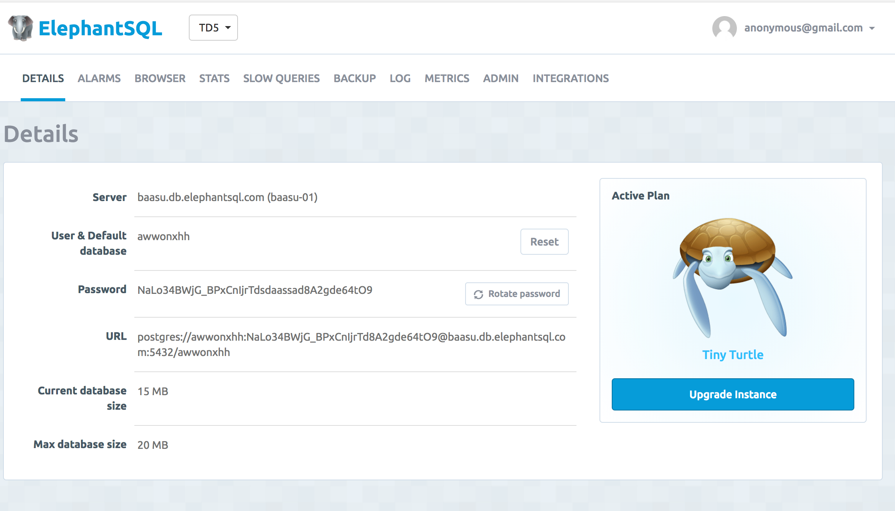
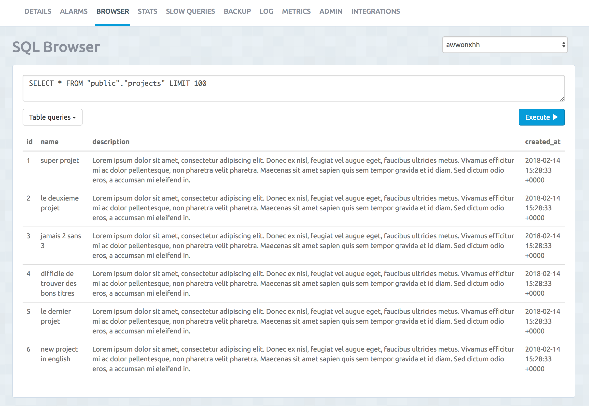
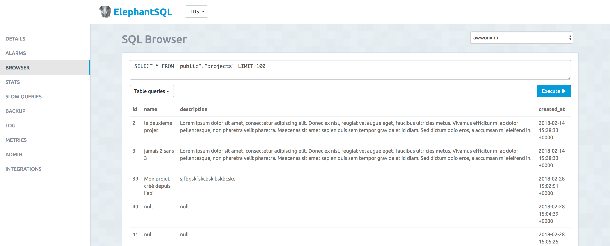

# Récapitulatif du cours du 23 Fevrier 2020

Jusqu'à présent nous avons vu comment afficher du contenu dynamique d'une page à une autre, mais sans pour autant utiliser de base de données. L'ensemble des données utilisées, que ce soit les projets ou la liste des utilisateurs (utilisée pour l'authentification) ont été persisté de façon statique dans deux fichiers respectifs:

* ./projects.json
* ./users.json

Cela fonctionne, mais n'est pas aussi flexible et puissant que d'utiliser une Base de Données afin de persister les données. À la place nous allons utiliser un SGBD et plus précisément:  PostgreSQL qui n'est pas le seul, mais jouit d'une certaine notoriété au sein de la communauté.

## Accès à la base de données PostgreSQL
Afin de nous faciliter la tâche, nous utilisons [elephantsql.com](https://www.elephantsql.com) qui est un service SaaS proposant la création de BD dans le "cloud" en quelques clics. Il est tout à fait possible d'installer soit même une instance de postgres (en local, ou bien sur un serveur), mais ceci nécessite bien entendu un peu de temps et de connaissances supplémentaires.

Une fois notre compte créer nous avons directement accès aux informations de connexion



### Ajouts des données dans notre base de données.


Une fois l'ajout effectué, il est possible de facilement confirmer la présence des données via l'interface web proposée par elephantsql.



Ici on voit bien que nous avons les projets qui sont présents dans notre BD.

## Import d'un jeu de données de test
Lors de tout développement, il est important, dès lors que vous avez votre modèle de données (tables dans la BD), de créer et d'importer un jeu de données de tests.
Il est une bonne pratique que de créer un script à cet effet permettant tout nouveau collaborateur au projet de facilement import le jeu de données.

Dans notre cas nous avons créé deux fichiers:

* **db/populate.sql**: Contient l'ensemble des instructions SQL à exécuter: création des tables, insertions d'entrées de test.
* **db/import.js**: Script permettant l'exécution des instructions SQL définies dans le fichier populate.sql

Afin d'importer (ou re-importer) les données dans notre BD, il suffit d'appeler le script import.js via la commande `node db/import.js` ou le raccourci `npm run importdb` (defini dans package.json)

### Utilisation du package `pg`
Afin de nous connecter à la base de données depuis notre application nous avons besoin d'un Client PostgreSQL pour node. Il en existe plusieurs, mais dans le cadre de ce cours nous allons utiliser l'un des plus populaires: `pg`.

*Note: En fonction de la version de node utilisée, il est nécessaire d'installer une version plus ou moins récente.*

### Si vous utilisez une version de NodeJS > 6.3

`npm install --save pg` // installe la dernière version en date

Une fois installé, pg s'utilise de la façon suivante:

```js
const { Pool } = require('pg');

// 1. Connection
const pool = new Pool({
  user: 'TO_REPLACE',
  host: 'TO_REPLACE',
  database: 'TO_REPLACE',
  password: 'TO_REPLACE',
  port: 5432,
});

function executeQuery(sql, params, callback) {
  // 1. Connection
  pool.connect((err, client, done) => {
    if (err) {
      return console.error('Error fetching client from pool', err);
    }
    // 2. Execute the query
    client.query(sql, params, (err, result) => {
      // 3. Close Connection
      done();

      if (err) {
        console.log(err);
      } else {
        // 4. Execute the callback(res)
        callback(result);
      }
    });
  });
}
```

## Vérification du bon déroulement de l'import
Une fois l'import terminé, il nous est possible de retourner sur l'interface de gestion de elephantsql.com afin de vérifier la bonne création des tables + insertion des données dans ces dernières.




## Refactoring de notre code afin d'intégrer la liaison avec la BD
Jusqu'à présent notre application est en mesure d'afficher dynamiquement une liste de projets, mais cette dernière est persisté de façon statique dans le fichier `./projects.json`. Maintenant que nous avons la liste de ces projets disponible dans notre BD, nous allons refactorer notre code afin de demander à notre application d'interroger la BD.

Pour ce faire un nous suffit de modifier la logique métier associée à nos routes relatives aux projets.

Ici la simple requête SQL `SELECT * FROM projects` suffis à récupérer la liste des projets stockée dans la BD.

Extrait du  fichier *routes/projects.js*
```js
router.get('/', (req, res) => {
   executeQuery("SELECT * FROM projects", [], (result) => {
    res.render("projects", {projects_list: result.rows});
   });
});

function executeQuery(sql, params, callback){
  // 1. Connection
  // 2. Execute the query
  // 3. Close Connection
  // 4. Execute the callback(res)
}
```

Note: Nous avons vu qu'en fonction de la version de node utilisée, la syntaxe d'utilisation du module `pg` est légèrement différente. Par conséquent, veuillez vous référer au fichier `routes/projects.js` afin de voir l'implémentation de la fonction `executeQuery(sql, params, callback)` dans son détail.

### Passage de paramètres dans la requête SQL
Parfois il est nécessaire de passer des paramètres dynamiques à notre requête SQL. C'est par exemple le cas lorsque l'on souhaite l'ensemble des informations relatives à un projet donné. Pour ce faire nous devons passer l'ID du projet.

Bonne nouvelle, méthode `query` de pg nous permet de passer en second paramètre un tableau avec l'ensemble des paramètres que nous souhaitons remplacer dans notre query SQL.

```js
router.get('/:id', (req, res) => {
    executeQuery("SELECT * FROM projects WHERE id=$1", [req.params.id], (result) => {
        let details = result.rows[0];
        res.render('project_details', { project: details });
    });
});
```
Les valeurs des paramètres passés sont ensuite accessibles dans la requête SQL via la notation `$1`, `$2`, `$...`. Ici le chiffre correspond à la position dans tableau commençant à 1.

#### [Important] Sécurisation
Nous venons de voir comment passer dynamiquement des valeurs à notre requête SQL. C'est pratique, mais aussi vite dangereux dans le cas où les valeurs utilisées sont proviennent de la saisie d'un utilisateur, où que ce dernier à moyen de modifier leurs valeurs. C'est le cas ici, lorsque l'on souhaite afficher le détail d'un projet en passant son ID dans l'URL
```localhost:3000/projects/5```
Ici rien n'empêche un utilisateur mal intentionné de remplacer la valeur `5` par autre chose pouvant conduire à une faille de sécurité type `Injection SQL`

**Définition**
> L'injection SQL directe est une technique où un pirate modifie une requête SQL existante pour afficher des données cachées, ou pour écraser des valeurs importantes, ou encore exécuter des commandes dangereuses pour la base. Cela se fait lorsque l'application prend les données envoyées par l'internaute, et l'utilise directement pour construire une requête SQL. Les exemples ci-dessous sont basés sur une histoire vraie, malheureusement.

Fort heureusement, l'utilisation du package `pg` (et du framework express plus généralement) nous permet d'éviter d'exposer cette faille de sécurité connue de tous. En effet pg intègre déjà une logique `escaping` (=Protège les caractères spéciaux SQL) des chaines de caractère passées dans la requête SQL, et de ce fait empêche les injections SQL.

## Plus d'info sur les Callback
Nous avons vu dans les premiers cours que l'une des forces de NodeJS est d'être environnement de développement JavaScript basé sur les évènements. En d'autres mots qui sont dit "Asyncrone" ou encore 'Non-bloquant', et ce malgré sa nature mono thread de nodeJS -> toutes les opérations sont exécutées à la suite sans possibilité de parallélisation.

Dans notre cas, il n'est pas possible de savoir combien de temps va prendre l'exécution de nos requêtes SQL. Afin de ne pas bloquer l'exécution de notre application, nous mettons à profit l'utilisation de callback. Les `callback` ne sont ni plus ni moins qu'une façon de décrire une fonction JS passée en paramètre d'une autre fonction et qui sera appelée une fois le l'exécution d'un événement asynchrone terminée.

```js
function sayHello(name) {
  console.log(`Hello ${name}`);
}

// Appel sayHello après 5 secondes
setTimeout(() => {
  sayHello("Pierre");
}, 5000);

sayHello("Marie");
```

Output dans la console:
```
Hello Maire
...(5 seconds)...
Hello Pierre
```

Ici la fonction `() => { sayHello("Pierre") }` est passée comme callback de la fonction `setTimeout`.

### Utilisations des Promises
Afin de faciliter l'écriture du code, il est possible de rendre plus lisible l'enchainement de callback via l'utilisation de Promises.

* [Les Promises, késako ?](https://blog.groupe-sii.com/les-promises-en-javascript/)
* [Utiliser des promises à la place des callbacks](https://oncletom.io/node.js/chapter-03/#promise)

### Ressources complémentaires:
* [https://openclassrooms.com/courses/des-applications-ultra-rapides-avec-node-js/les-evenements-18](https://openclassrooms.com/courses/des-applications-ultra-rapides-avec-node-js/les-evenements-18)
* [Fonctionnement de l'eventLoop en JS - Vidéo YouTube (EN - 20min)](https://www.youtube.com/watch?v=6MXRNXXgP_0)

# Création d'un CRUD pour la gestion des projets
Maintenant que nous savons comment connecter notre application à une base de données Postgres, que nous savons y importer de la donnée par batch, ou encore lister des entrées comme des projets, il est temps de voir comment créer un CRUD. En anglais `CRUD` est un acronyme utilisé pour décrire un système de manipulation des données de la base.

Pourquoi CRUD?, pour la raison suivante:

* **C**reate
* **R**ead
* **U**pdate
* **D**elete

C'est l'objet du TD `12 Database advanced` dans lequel:

* la logique de connexion à la DB ainsi que l'exécution des requêtes a été déplacé dans un nouveau module déclaré dans le fichier `./utils.js`
* de nouvelles routes ont été crées `localhost:3000/projects/add`, `localhost:3000/projects/update`, `localhost:3000/projects/delete`
