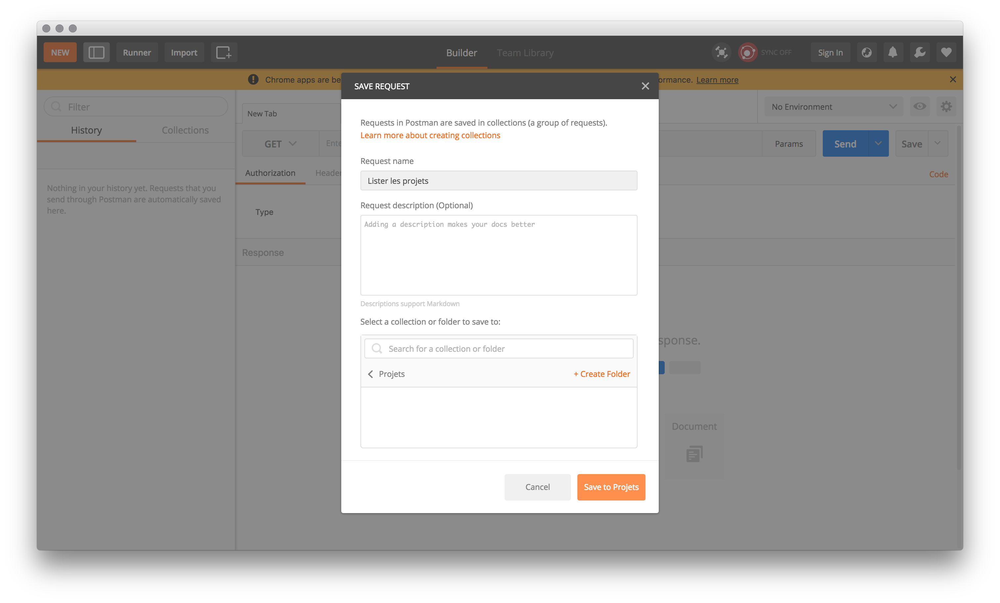
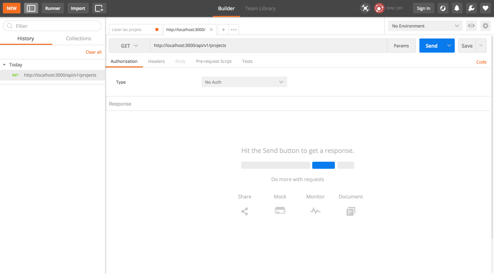

# Création d'une API REST
Jusqu'à présent nous avons vu comment créer et faire évoluer notre backend afin de créer une application web à destination d'utilisateurs finaux consultant le contenu depuis un navigateur internet. Pour ce faire nous avons créé des routes (majoritairement de type GET) permettant de décrire l’arborescence navigation du site, pour lesquelles nous avons ajouté la logique métier permettant de récupérer de la donnée depuis notre BD, et ensuite la passer à notre moteur de template (ici PUG) afin que ce dernier puisse retourner au navigateur faisant la requête un `200 OK` ainsi qu'un `fichier au format HTML`.

## Qu'est ce qu'est une API REST?
L'acronyme API, pour **A**pplication **P**rogramming **I**nterface, est une interface permettant à d'autres applications d'interagir avec l'application exposant l'API. Aussi bien pour accéder à des données, que bénéficier de services (= fonctionnalités) rendus par ces applications tiers.

De nos jours on retrouve des APIs partout. Que ce soit sur le web où l'on peut accéder à certaines données de réseaux sociaux via l'API de Facebook / Twitter / ..., avec des services comme Stripe, PayPal ... ou bien sur notre TV connectée afin d'étendre leurs possibilités. Bref, les API sont partout, et il est fort à parier que vous-même serrez amené à travailler sur des applications exposant des APIs.

Alors mieux vaut ne pas perdre de temps et créer notre première API. Celle-ci vous permettra d'interagir avec notre application back-end au travers de requêtes AJAX depuis le front-end. Permettant ainsi une expérience plus fluide et immersive pour les utilisateurs.

=> Informations complémentaires sur ce qu'[Est une API sur OpenClassroom](https://openclassrooms.com/courses/utilisez-des-api-rest-dans-vos-projets-web/)

=> Vidéo YouTube (FR- 20min) [API REST JSON - Explication et exemples](https://www.youtube.com/watch?v=UQwjytQzoqE)

## Que signifie REST?
REST, acronyme de **RE**presentational **S**tate **T**ransfer, n'est pas un langage ou un protocole, mais plutôt un style d'architecture créée en 2000 et s'appuyant sur le protocole HTTP et ses richesses.

=> Informations complémentaires sur l'[article Wikipedia](https://fr.wikipedia.org/wiki/Representational_state_transfer)

## Design de notre API - Partie théorique

À la différence des sites internet, qui n'utilisent que les méthodes `GET` et `POST`, les API REST utilisent la richesse du protocole HTTP. Ce dernier définit un certain nombre de méthodes qui affectent une signification sémantique à une requête. Les méthodes HTTP utilisées par la plupart des API web RESTful sont les suivantes :

* **GET** récupère une représentation de la ressource à l’URI spécifié. Le corps du message de réponse contient les détails de la ressource demandée.
* **POST** crée une ressource à l’URI spécifié. Le corps du message de requête fournit les détails de la nouvelle ressource. Notez que POST permet également de déclencher des opérations qui ne créent pas réellement de ressources.
* **PUT** crée ou remplace la ressource à l’URI spécifié. Le corps du message de requête spécifie la ressource à créer ou mettre à jour.
* **PATCH** effectue une mise à jour partielle d’une ressource. Le corps de la requête spécifie l’ensemble de modifications à appliquer à la ressource.
* **DELETE** supprime la ressource à l’URI spécifié.

L’effet d’une requête spécifique sera différent, selon que la ressource est une collection ou un élément individuel. Le tableau suivant résume les conventions courantes adoptées par la plupart des implémentations RESTful suivant l’exemple d'un gestionnaire de tâches (aussi appelé TODO-List). Notez que certaines de ces requêtes ne peuvent pas être implémentées ; cela dépend du scénario spécifique.

Ressource URL | POST | GET | PUT | DELETE
--- | --- | --- | --- | ---
/lists | Créer une liste de tâches | Récupérer toutes les listes | Mettre à jour des listes en bloc | Supprimer toutes les listes
/lists/1 | Erreur | Récupérer les détails de la liste 1 | Mettre à jour les détails de la liste 1 si elle existe | Supprimer la liste 1
/lists/1/tasks | Créer une tache dans la liste 1 | Récupérer toutes les taches de la liste 1 | Mettre à jour taches en bloc pour la liste 1 | Supprimer toutes les taches de la liste 1
/lists/1/tasks/1 | Erreur | Récupérer les détails de la tache 1 | Mettre à jour les détails de la tache 1 si elle existe | Supprimer la tache 1

Les différences entre POST, PUT et PATCH peuvent prêter à confusion.

* Une requête POST crée une ressource. Le serveur assigne un URI à la nouvelle ressource et renvoie cet URI au client. Dans le modèle REST, vous appliquez fréquemment les requêtes POST aux collections. La nouvelle ressource est ajoutée à la collection. Une requête POST peut également être utilisée pour envoyer des données pour le traitement d’une ressource existante, sans qu’une nouvelle ressource ne soit créée.

* Une requête PUT crée une ressource ou met à jour une ressource existante. Le client spécifie l’URI de la ressource. Le corps de la requête contient une représentation complète de la ressource. Si une ressource avec cet URI existe déjà, elle est remplacée. Sinon, une ressource est créée si le serveur peut prendre en charge cette opération. Les requêtes PUT sont plus fréquemment appliquées à des ressources qui sont des éléments individuels, par exemple un client spécifique, plutôt qu’à des collections. Un serveur peut prendre en charge les mises à jour, mais pas la création via la méthode PUT. Prendre en charge la création via la méthode PUT dépend de la capacité du client à assigner de façon explicite un URI à une ressource avant qu’elle existe. S’il n’est pas en mesure de le faire, utilisez la méthode POST pour créer des ressources et les méthodes PUT ou PATCH pour effectuer une mise à jour.

* Une requête PATCH effectue une mise à jour partielle vers une ressource existante. Le client spécifie l’URI de la ressource. Le corps de la requête spécifie un ensemble de modifications à appliquer à la ressource. Cela peut être plus efficace que l’utilisation de la méthode PUT, étant donné que le client envoie uniquement les modifications, et non pas la représentation entière de la ressource. Techniquement, la méthode PATCH peut également créer une ressource (en spécifiant un ensemble de mises à jour vers une ressource « null »), si le serveur prend en charge cette opération.

Les requêtes PUT doivent être idempotentes. Si un client envoie la même requête PUT plusieurs fois, les résultats doivent toujours être identiques (la même ressource sera modifiée avec les mêmes valeurs). Le caractère idempotent des requêtes POST et PATCH n’est pas garanti.

*Note: Ce paragraphe est en grande partie issue de l'article [Conception d'API sur le site de Microsoft](https://docs.microsoft.com/fr-fr/azure/architecture/best-practices/api-design). Sans contest un très bon article pour quiconque souhaitant approfondir ses connaissances dans le domaine (ou bien pour le projet ;-))*

## Design de notre API - Partie pratique

C'est l'objet du TD `08 REST API` qui se concentre sur l'exposition du CRUD permettant la gestion des projets, mais cette fois-ci au travers d'une API REST.

Rappelez-vous, nous avions créé la route `projects/` accessible à l'URL `http://localhost:3000/projects`, permettant l'affichage de la liste des projets sur notre site.
Celle-ci dès lors que `res.render('projects', { projectsList: result.rows })` est appelé

1. Génère le fichier HTML via le template PUG défini ainsi que les données `projectsList` passées en paramètre.
2. Retourne le ficher HTML en réponse à la requête faite par le client HTTP (ici un navigateur internet)

Extrait du fichier **./routes/projects.js**
```js
router.get("/", (req, res) => {
  utils.executeQuery("SELECT * FROM projects", [], (result) => {
    res.render("projects", { projectsList: result.rows });
  });
});
```

### Création de notre première URI permettant de récupérer la liste de projets.

Afin de créer notre première URI / URL exposée par notre API, il nous suffit (ni plus ni moins), de copier/coller ce que nous avions fait, et de replacer `res.render` par `res.json`.
La [méthode `res.json` exposée par le framework Express](http://expressjs.com/fr/4x/api.html) a pour effet de retourner une réponse au format JSON. Ce qui tombe bien, car c'est le format d'échange de données que nous avons choisi pour notre API. (Note: nous aurions pu choisir XML mais ce dernier est quasisement plus utilisé par les APIs modernes).

Extrait du fichier **./routes/api.js**
```js
router.get("/projects", (req, res) => {
  utils.executeQuery("SELECT * FROM projects", [], (err, result) => {
    res.json({ projectsList: result.rows });
  });
});
```

Voici la réponse HTTP


```json
HTTP/1.1 200 OK
Content-Type: application/json; charset=utf-8
Content-Length: 3769
Date: Sun, 04 Mar 2018 22:53:17 GMT
Connection: keep-alive

{"projectsList":[{"id":2,"name":"le deuxieme projet","description":"Lorem ipsum dolor sit amet", ...}]}
```

Ce qui correspond au contenu suivant une fois formaté avec la bonne indentation.
```json
{
  "projectsList": [
    {
      "created_at": "2018-02-14T14:28:33.040Z",
      "description": "Lorem ipsum dolor sit amet, consectetur adipiscing elit. Donec ex nisl, feugiat vel augue eget, faucibus ultricies metus. Vivamus efficitur mi ac dolor pellentesque, non pharetra velit pharetra. Maecenas sit amet sapien quis sem tempor gravida et id diam. Sed dictum odio eros, a accumsan mi eleifend in.",
      "id": 3,
      "name": "jamais 2 sans 3"
    },
    {
      "created_at": "2018-02-14T14:28:33.040Z",
      "description": "Lorem ipsum dolor sit amet, consectetur adipiscing elit. Donec ex nisl, feugiat vel augue eget, faucibus ultricies metus. Vivamus efficitur mi ac dolor pellentesque, non pharetra velit pharetra. Maecenas sit amet sapien quis sem tempor gravida et id diam. Sed dictum odio eros, a accumsan mi eleifend in.",
      "id": 2,
      "name": "le deuxieme projet"
    }
    ...
  ]
}
```

### Création des autres URI

La logique reste la même pour les autres actions nécessaires à la l'exposition d'un CRUD via notre API. De cette manière nous pouvons facilement exposer des routes permettant:

* Ajouter un nouveau projet
* Supprimer le projet dont l'ID est passée en param
* Afficher le detail du projet dont l'ID est passée en param
* Mettre à jour le projet dont l'ID est passée en param


### Passage de paramètres
Afin d'enrichir le comportement de notre API il est souvent intéressant de passer des paramètres à nos requêtes d'API. Ceci est monnaie courante lorsque l'on utilise les méthodes POST et PUT, mais aussi lorsque l'on utile la méthode GET. À la difference près que les valeurs doivent être passées sous forme de param dans l'URI.
Par exemple, en créer le paramètre `sortBy` pour la route `/api/v1/projects` utilisable de la façon suivante ```http://localhost:3000/api/v1/projects?sortBy=createdAt_asc```

Côté code il est très facile de récupérer la valeur du param `sortBy` grâce au framework Express qui la rend disponible dans la variable `req.query.ANY_PARAM_NAME`


Extrait du fichier **./routes/api.js**
```js
router.get("/projects", (req, res) => {
  let sortBy = req.query.sortBy;
  let orderByString = "id DESC";

  switch (sortBy) {
    case "name_asc":
      orderByString = "name ASC";
      break;
      
    ...
  }

  ...
};
```

#### Bonus: Pagination des éléments demandés
De la même façon nous pourrions imaginer créer deux nouveaux paramètres: `page=1&limit=10`. Ceci nous permettrait de créer un système de pagination afin par exemple de récupérer la liste des projets par lots de 10. Une bonne pratique est alors de retourner en plus des données demandées le nombre total d'éléments demandé, et ce afin de calculer le nombre maximum de pages accessibles. Par exemple si la BD continet 34 projets, il sera alors possible d'aller en `page=4` si `limit=10` ou encore en `page=8` si `limit=5`, mais pas en `page=10` si `limit=10`. Autrement cela reviendra à vouloir accéder aux éléments 101 à 110 alors que notre BD n'en contient que 34.


## Tester son API à l'aide d'un client REST
Tester son API est trivial lorsqu'il s'agit de tester des requêtes GET, car un simple navigateur internet suffit. Pour les autres méthodes HTTP ce n'est pas tellement difficile, mais il faut s'équiper d'une Client HTTP permettant de faire des requêtes GET, POST, PUT, PATCH UPDATE.

Comme pour d'autres outils il existe pléthore de client REST. Dans notre cas nous avons choisi [POSTMAN](https://www.postman.com/) qui peut facilement s'installer sur Chrome et qui reste simple d'utilisation.

Une fois installé, il nous est simple de sauvegarder notre premier test. Disons que l'on souhaite commencer par récupérer la liste des projets via l'API.



Une fois le test créer il nous suffit plus qu'à renseigner `URI`, la `méthode HTTP` à utiliser et les `éventuels paramètres`.



De la même façon, il est possible de créer et sauvegarder les autres URI exposés par notre API.

### Lecture complémentaire
On vous recommande la lecture de l'article suivant pour parfaire vos connaissances sur l'utilisation de POSTMAN: [Tutoriel détaillé sur l'utilisation de POSTMAN](https://amethyste16.wordpress.com/2018/03/03/tutoriel-postman-2/)


## Sécurité
Il est important de noter qu'à ce stade l'API créée n'est pas sécurisée.

Même s'il existe une multitude de sécuriser une API REST et de restreint son accès à certains utilisateurs ou groupes d'utilisateurs, il n'en reste pas moins que certain d'entre eux reste plus connus et utilisés que d'autres. C'est le cas de

* HTTP Authentifaction, type Basid Auth
* Clef d'API
* OAuth
* Javascript Web Tokens (JWT)

La méthode `OAuth` est certainement la plus répandue aujourd'hui sur internet. Du moins pour les API permettant l'accès à des données utilisateurs telles que Facebook, Twitter.
Il n'y a pas de meilleure solution, chacune d'entre elles à ses qualités et défaut, et répond à un besoin propre

### Lectures complémentaires
* [Web API & Authentification HTTP Basic](https://www.softfluent.fr/blog/expertise/Web-API-Authentication-Basic)
* [Intro à JWT](https://www.vaadata.com/blog/fr/jetons-jwt-et-securite-principes-et-cas-dutilisation/)
* [Intro à OAuth2](http://www.bubblecode.net/fr/2016/01/22/comprendre-oauth2/)
